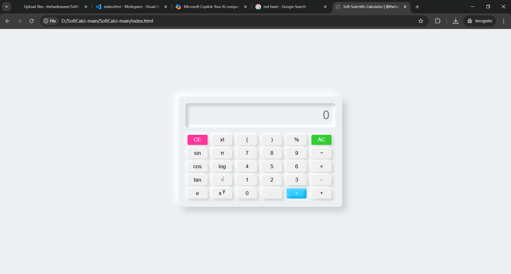

# 🧮 Soft Scientific Calculator

## 🌐 Preview
[Live Preview](https://thehadinaseer.github.io/softcalci)

## 📜 Description
The Soft Scientific Calculator is a versatile and user-friendly tool designed to perform a wide range of mathematical calculations with ease. Featuring a sleek and intuitive interface, this calculator supports various scientific functions, making it an essential tool for students, professionals, and anyone with a love for numbers.

## 🛠️ Technologies Used
- **HTML**: Structuring the content of the webpage
- **CSS**: Styling and layout to ensure a visually appealing design
- **Vanilla JavaScript**: Adding interactivity and advanced calculations

## 📂 Usage
To view and use the Soft Scientific Calculator, follow these steps:

1. Clone the repository:
    ```bash
    git clone https://github.com/thehadinaseer/softcalci.git
    ```

2. Navigate to the project directory:
    ```bash
    cd softcalci
    ```

3. Open the `index.html` file in your preferred web browser:
    ```bash
    open index.html
    ```

## 🌟 Features
- **User-Friendly Interface**: Easy to navigate and use
- **Scientific Functions**: Supports a variety of advanced calculations
- **Responsive Design**: Ensures the calculator looks great on all devices
- **Customizable**: Easily modify content to suit your needs

## 📸 Screenshots


## 📄 License
This project is licensed under the MIT License - All Rights Reserved! 2025.

## 📧 Contact
For any inquiries or feedback, feel free to reach out:

- **GitHub**: [@thehadinaseer](https://github.com/thehadinaseer)
- **Email**: [hadinaseer066@gmail.com](mailto:hadinaseer066@gmail.com)

## 💬 Credits
&copy; @thehadinaseer & [github.com/thehadinaseer](https://github.com/thehadinaseer)
